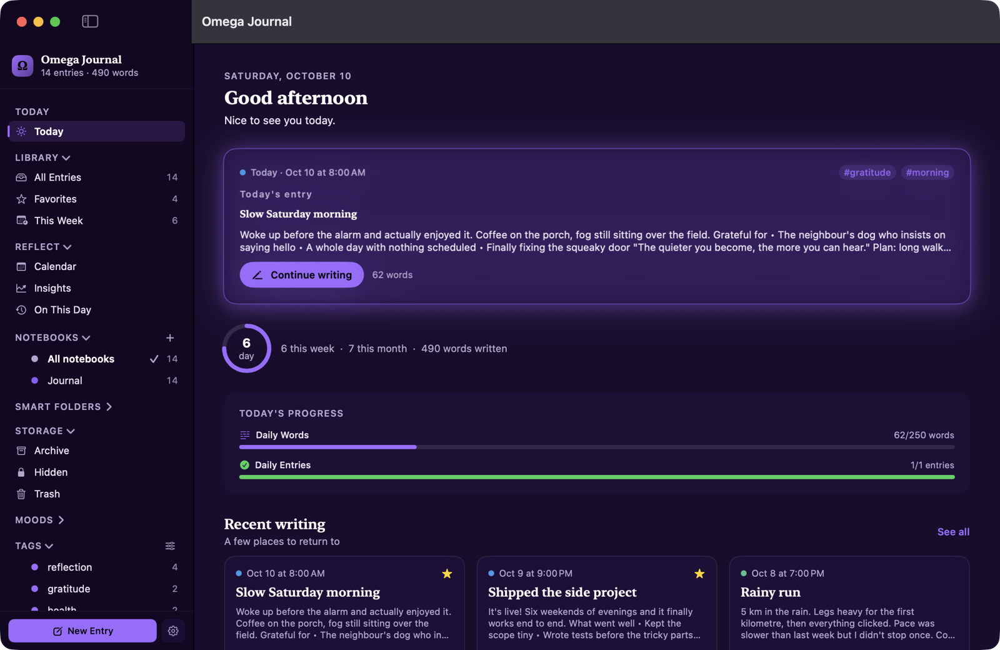
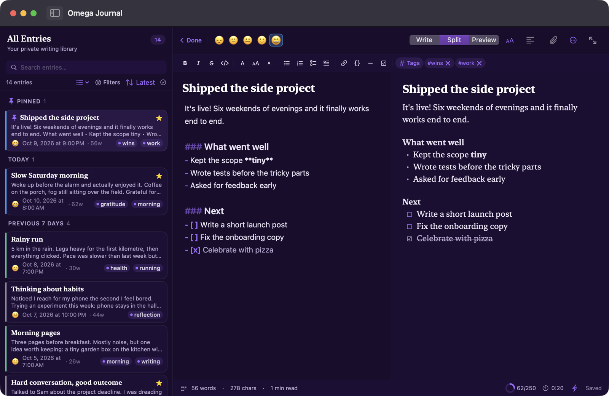
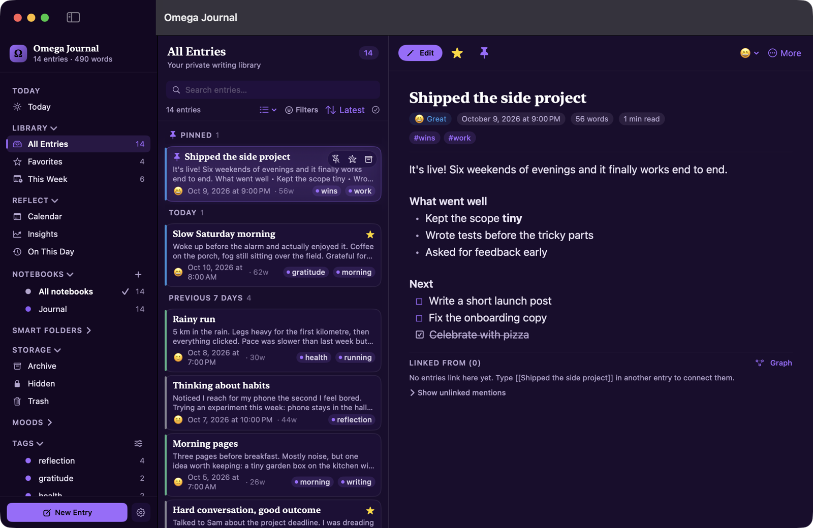
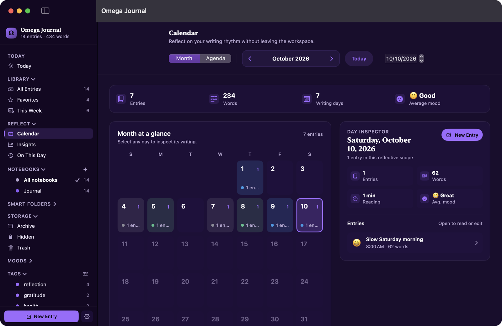
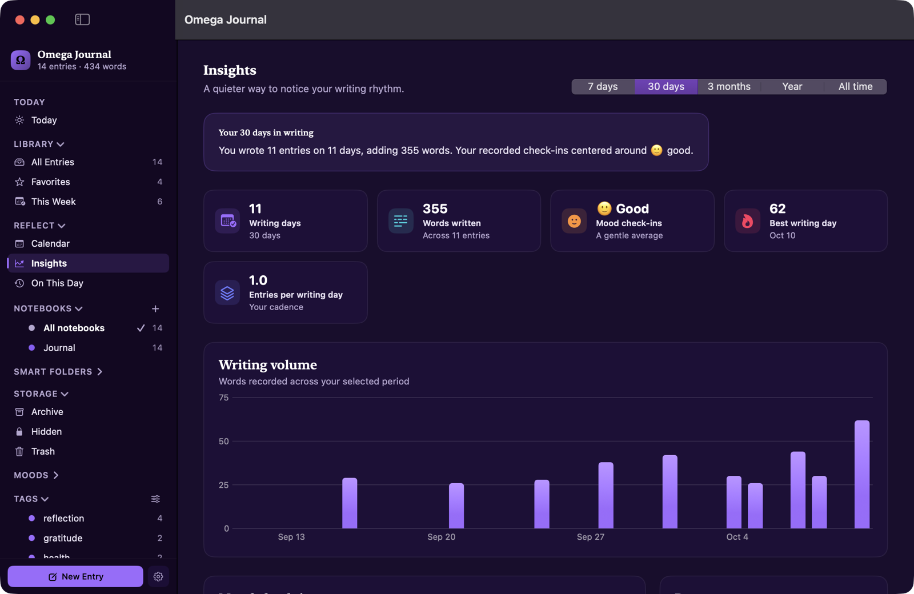

<p align="center">
  
</p>

<h1 align="center">Omega Journal</h1>

<p align="center">
  <strong>A native, local-first journal for macOS.</strong><br>
  Write freely. Organize your thoughts. Keep ownership of your words.
</p>

<p align="center">
  
  
  
  
  
  <a href="https://github.com/Eplisium/omega-journal/actions/workflows/ci.yml"></a>
</p>

<p align="center">
  
</p>

**Omega Journal is a calm, private place to write — a native Mac journal that keeps your words on your Mac.**
No account, no cloud, no tracking. Just open it and write in Markdown, then find your way back to what mattered with tags, notebooks, a calendar, and gentle insights.

<p align="center">
  <a href="https://github.com/Eplisium/omega-journal/releases/latest"><strong>⬇︎ Download for macOS</strong></a>
  &nbsp;·&nbsp;
  <a href="#build-from-source">Build from source</a>
  &nbsp;·&nbsp;
  <a href="CONTRIBUTING.md">Contribute</a>
  &nbsp;·&nbsp;
  <a href="https://github.com/Eplisium/omega-journal/discussions">Discussions</a>
</p>

## Why Omega Journal

- **Writing first.** Open the app and start typing. A native Markdown editor with live split preview, focus and typewriter modes, templates, and daily prompts.
- **Yours, locally.** Entries live in a SQLite database on your Mac. Entry text, attachments, and automatic backups are encrypted with a key kept in your Keychain. No sign-up, no servers.
- **Find your way back.** Tags, notebooks, smart folders, full-text search with operators, linked entries (`[[like this]]`), a calendar, and On This Day.
- **Notice patterns, without pressure.** Mood check-ins, writing rhythm, and insights that stay quiet and kind.
- **Truly native.** SwiftUI + AppKit, keyboard-first, themes, Quick Capture from the menu bar, optional Spotlight title search, and zero third-party dependencies.

<table>
  <tr>
    <td></td>
    <td></td>
  </tr>
  <tr>
    <td align="center"><sub>Write in Markdown with live preview</sub></td>
    <td align="center"><sub>Read entries beautifully rendered</sub></td>
  </tr>
  <tr>
    <td></td>
    <td></td>
  </tr>
  <tr>
    <td align="center"><sub>Browse your writing by day</sub></td>
    <td align="center"><sub>Gentle insights into your rhythm</sub></td>
  </tr>
</table>

<sub>Screenshots use a demo journal with made-up entries.</sub>

## Install

1. Download the latest **`Omega-Journal-*.dmg`** from [Releases](https://github.com/Eplisium/omega-journal/releases/latest).
2. Open it and drag **Omega Journal** into **Applications**.
3. The app isn't notarized by Apple yet, so the first launch needs one extra step: open it once, then go to **System Settings → Privacy & Security** and click **Open Anyway** (or right-click the app → **Open**).
4. On first launch macOS asks permission for Omega Journal to store its encryption key in your Keychain — choose **Always Allow**.

Requires macOS 14 Sonoma or later.

**Honest about privacy:** some metadata (titles, tags, moods, dates) is stored unencrypted so search stays fast, automatic backups don't include attachment files, and whole-app locking isn't fully wired up yet. See [Privacy and security](#privacy-and-security), [Backups and recovery](#backups-and-recovery), and [Current limitations](#current-limitations).

## Contents

- [Build from source](#build-from-source)
- [Workspaces](#workspaces)
- [Writing and reading](#writing-and-reading)
- [Organization and discovery](#organization-and-discovery)
- [Reflection and writing habits](#reflection-and-writing-habits)
- [Appearance and Mac integration](#appearance-and-mac-integration)
- [Privacy and security](#privacy-and-security)
- [Backups and recovery](#backups-and-recovery)
- [Import and export](#import-and-export)
- [Keyboard shortcuts](#keyboard-shortcuts)
- [Current limitations](#current-limitations)
- [Storage and architecture](#storage-and-architecture)
- [Contributing](#contributing)

This README describes the current source implementation, not a claim that every feature has passed a fresh end-to-end or accessibility audit. Partially integrated features are called out explicitly.

## Build from source

Requires macOS 14 Sonoma or later and a recent Xcode/Swift toolchain (Swift 6+, which includes Swift Testing). On-device AI infrastructure has separate macOS 26/Apple Intelligence requirements and is not yet a complete user workflow.

```bash
git clone https://github.com/Eplisium/omega-journal.git
cd omega-journal
swift build
swift test
bash build_app.sh
open "Omega Journal.app"
```

`swift build` compiles the executable. `build_app.sh` builds a release binary, packages **Omega Journal.app**, and regenerates the Ω icon. Repackage and reopen the bundle after source changes; compiling alone does not update the double-clickable app.

## Workspaces

- **Today:** start or continue writing, see daily goal progress (when goals are set), revisit recent entries, and surface an On This Day memory. The daily prompt card is shown for a small library; prompt-based creation remains available from the menu.
- **Journal:** library sidebar, entry cards, and a reader/editor. Browse favorites, this week, moods, tags, smart folders, archive, hidden entries, and trash.
- **Calendar:** month and agenda browsing with entry drill-through.
- **Insights:** writing activity, mood trends, patterns, and year review.
- **On This Day:** revisit entries associated with today's calendar date.

Archive removes entries from the active library without deleting them. Trash is a soft delete with restoration and permanent-deletion actions; expired trash is purged after the 30-day retention period when database startup maintenance runs.

## Writing and reading

### Native Markdown editor

- Write, split-preview, and preview modes.
- Native text editing, undo, spell-checking, find, and replace.
- Markdown syntax highlighting and debounced live preview.
- Autosaved title, body, mood, and tags; pending edits are flushed when finishing editing and on quit.
- Bold, italic, strikethrough, inline code, headings, lists, checklists, quotes, links, code blocks, and dividers.
- Automatic list continuation and Tab/Shift-Tab indentation.
- `/` suggestions for formatting, tables, date/time, mood, wiki links, and saved templates.
- `[[` entry-title completion, excluding the current entry and locked hidden targets.

Focus controls include Zen mode, typewriter scrolling, inactive-paragraph dimming, font style/size, line height, and editor column width. The footer shows writing statistics, save state, session duration/net words/WPM, daily word-goal progress, and 10- or 20-minute writing sprints.

Place/weather metadata can be entered manually. It is not fetched from a weather service or automatically geolocated.

### Templates and prompts

Built-in template definitions include **Daily Reflection, Gratitude, Weekly Review, Dream Log, Decision Log, and Blank**. Create, edit, duplicate, delete, and reorder templates, with an icon and default tags.

Template variables are expanded when used:

```text
{{date}}  {{time}}  {{weekday}}  {{prompt}}  {{mood}}
```

The template editor includes an expansion preview. Slash insertion can insert a template into an existing entry and merge its tags. A separate daily-prompt action helps start a blank page.

### Attachments and audio

Attach files through the picker, Finder drag-and-drop, or image paste. The limit is **25 MB per attachment**. Images use internal `omega-attachment://` references, render inline, and offer Small/Medium/Large/Original sizing. The reader displays attachment thumbnails and open/remove actions.

The editor includes a voice recorder with permission handling, waveform, elapsed time, Cancel, and **Stop & attach**. Recordings use mono AAC `.m4a`; the reader provides playback and progress. There is no transcription or seek UI.

**Recording caution:** the current automatic ten-minute cutoff discards the stopped recording instead of attaching it. Use **Stop & attach before the cutoff** until this is fixed.

### Reader and revisions

The reader provides selectable Markdown, table grids, interactive task checkboxes, wiki links, backlinks, optional first-image cover, reading-font preferences, and metadata. Actions include edit, pin, favorite, duplicate, copy Markdown, print, export, archive, hide, and trash.

Revision history offers timestamped snapshots, word counts, line differences, and confirmed restoration. Restoring saves the current version first and restores **title/body only**, not tags, mood, or attachments. Revision bodies are encrypted. Automatic versions are coalesced/thinned over time, with a 200-revision cap.

The contents panel scrolls approximately rather than to exact heading anchors. Title-only revision restoration and the reader-width setting have known limitations listed below.

## Organization and discovery

### Notebooks

Create and edit colored notebooks, switch between one notebook and all notebooks, and move entries between them. New entries use the selected notebook or the default. Notebook selection persists and scopes loaded entries, search, graph targets, and much of reflection.

The default notebook cannot be deleted. Deleting another notebook moves its entries, including trash, to the default rather than deleting them. Notebook badges include nontrashed archived entries, so they can differ from active-list counts.

### Tags and smart folders

Tags support slash-delimited hierarchy such as `work/projects`, a collapsible tree, colors/inherited ancestor colors, suggestions, subtree rename/merge/delete, and drag-to-tag assignment.

Smart folders are persistent, live collections with pinning and criteria for text/operators, tags, moods, date range, attachments, and minimum word count. They use active entries in the current notebook scope and exclude locked hidden entries. Different criterion types combine with AND; multiple explicit folder tags/moods match with OR.

Parent-tag browsing and the older Save Search action have limitations; see [Current limitations](#current-limitations).

### Search

Search combines SQLite FTS5 metadata hits with decrypted, in-memory body matching. **Body plaintext is not written into the on-disk FTS index.** Recent searches and command-palette content hits are supported.

Operator examples:

```text
tag:work
#work
mood:good
after:2026-09-01 before:2026-10-01
has:image
has:attachment
has:link
has:task
```

- Tag operators include descendants; multiple tag operators combine with AND.
- Moods accept names or numeric values; multiple moods combine with OR.
- Dates accept day/month/year forms and `today`/`yesterday`. `after:` starts at the end of the specified date interval; `before:` excludes the specified interval.
- `has:link` recognizes web/Markdown links, not wiki links alone.
- Locked hidden entries may match visible title/mood/date, but operator search does not inspect their bodies, tags, or attachment/task predicates.

Search paths do not yet have identical semantics. Do not rely on Boolean expressions, negation, or consistent exact quoted-phrase matching.

### Linked entries

Use `[[Entry Title]]` to connect entries. The reader includes backlinks, unlinked mentions that can be converted to links, and an interactive force-directed graph with draggable/openable nodes and optional isolated entries.

Links resolve by **title**, not immutable entry ID. Duplicate titles can resolve inconsistently between navigation and graph views, and selecting a notebook limits available targets.

## Reflection and writing habits

### Moods, goals, and streaks

Entries have five mood levels: **Awful, Bad, Neutral, Good, Great**. Moods appear in cards, filters, charts, and summaries.

Configure daily words, daily entries, weekly words, and weekly entries goals. Streak policies include daily-with-rest and weekly writing-day targets.

Goal totals are global across notebooks, include hidden entries, and exclude archive/trash. Word progress uses the current word counts of entries created in the period—not an exact record of words typed during that period.

### Insights and reviews

Insights includes writing/word metrics, mood trend and distribution, activity heatmap, rhythm, recent writing, chart/day drill-through, tag/mood associations, themes/tone, streak history, and year review. Periods include seven days, thirty days, three months, calendar year, and all time.

Reflection uses active entries in the selected notebook scope, independent of transient list search. Archived/trashed entries are excluded; private inclusion requires authentication and an explicit choice.

Themes/tone use Apple's local NaturalLanguage framework. These are lightweight descriptive signals, not mental-health assessments or evidence of causation.

Settings → Writing Goals includes weekly/monthly review controls. Reviews summarize writing totals, mood, tags, favorite/pinned links, and reflection prompts and can be saved as entries. The reachable review-save action excludes hidden entries. Insights also offers a year selector and year-review PDF export.

### Partially integrated features

- **Review reminders:** scheduling controls exist, but clicking a notification is not connected to opening/generating the review.
- **Check-ins and habits:** database/store and analytics support sleep, energy, stress, custom metrics, and habit completion. The input components are not mounted in a reachable screen, so logging is not a finished feature.
- **On-device AI assist:** an opt-in setting and title/tag/summary service exist for macOS 26+ with Apple Intelligence. The service rejects hidden entries and uses Apple's on-device model, but no user workflow currently invokes suggestion generation.

## Appearance and Mac integration

Theme presets: **Purple, Midnight, Paper, Sepia, Forest, Ocean, Rose, Mono, and High Contrast**. Custom colors, per-preset accent overrides, system-following light/dark presets, and contrast warnings are available.

The UI uses shared typography, spacing, cards, chips, and buttons, with accessibility labels and reduced-motion/transparency accommodations. This is not a claim of a completed VoiceOver or accessibility-conformance audit.

Mac integration includes:

- Menu-bar quick capture with text, mood, extra tags, and the automatic `quick` tag; ⌘Return saves.
- Optional global **⌥⌘J** to open a new normal entry from another app.
- Dock-menu new entry, native print/file dialogs, and command palette.
- Optional Spotlight indexing, **off by default**, of non-hidden entry titles only—not bodies or tags.

Quick capture depends on the running main app; closing the last main window currently quits the app rather than leaving a standalone background capture service.

## Privacy and security

### Encryption boundaries

CryptoKit AES-256-GCM encrypts entry bodies, revision bodies, attachment files, and completed automatic database backups. The content key is stored in macOS Keychain with a device-only accessibility policy.

**The live SQLite database is not wholly encrypted.** Titles, tags, moods, timestamps, word counts, and other metadata remain readable. Someone with access to the Mac account/files may inspect that metadata. Hidden-entry authentication is an application content gate, not a replacement for protecting the Mac account and disk.

Body search runs in memory rather than persisting decrypted bodies in FTS. Missing-key safeguards refuse to create a replacement key when encrypted entries exist, avoiding silently orphaning their ciphertext.

### Hidden entries and locking

Hidden entries remain visible as masked cards. Protected content uses LocalAuthentication, such as Touch ID or the Mac password. **⌘L** re-masks hidden entries. Switching away also locks them by default; Settings can disable that behavior.

Reflection requires explicit private inclusion as well as authentication. Full exports request authentication for hidden content; cancelling omits hidden entries and reports the omission. Hidden-state metadata is preserved by the JSON format.

**Single-entry export:** **Export Entry… / ⌃⌘E** asks for Touch ID or your account password before exporting a locked hidden entry.

**Whole-app lock is unfinished:** settings and policy code exist, but the full-window lock overlay is not attached to the application root. Do not rely on it as a working launch/away lock. This is separate from hidden-entry locking.

### Files outside the app

Opening an attachment in another application creates a decrypted temporary copy in a private directory. Cleanup runs on launch and quit; the receiving application may make its own copies.

Ordinary Markdown, JSON, HTML, and PDF exports contain readable content. They do not inherit the journal's at-rest encryption. An optional extra backup folder may be cloud-synced by another service, and opening links uses external applications; local-first does not mean user-directed exports can never leave the machine.

## Backups and recovery

Automatic database backup is attempted during database startup at most once per local calendar day; failures can retry on the next launch. The latest **seven daily backups** are retained. This is launch-triggered, not an always-running daily scheduler.

Settings → Data & Backups includes manual backup, an extra backup folder, integrity checking, backup verification, and restore. Additional safety snapshots are taken before migrations and restores. Restore validates the database and schema compatibility, snapshots the current journal, and attempts rollback on failure.

**Recovery boundaries:**

- Database snapshots **do not contain attachment files**. Restoring leaves the attachment directory alone; missing attachment files are not recreated.
- Automatic backup encryption depends on the original Keychain key. A copied `.sqlite3` backup alone is not a portable recovery package for another Mac.
- The snapshot is created with SQLite `VACUUM INTO` and then sealed. Completed backups are encrypted; snapshot creation is not an entirely ciphertext-only disk operation.
- A passphrase-encrypted `.ojenc` export provides a portable entry/attachment export. Losing its passphrase means losing access; there is no passphrase recovery.
- Exports are not all equivalent to a complete app-state backup. JSON entry exports do not replace database backups for settings/check-ins and other database state.

Keep an independent, tested recovery strategy for both journal data and attachments. Do not treat seven local snapshots on the same disk as protection against losing that disk.

## Import and export

### Exports

- **Markdown document:** readable combined journal text and metadata.
- **JSON (format V6):** entry lifecycle/hidden state and notebook identity; the standard UI export embeds attachments and revision history.
- **PDF:** journal export, selected-entry export, printing, and year-review PDF.
- **Markdown folder:** one file per nontrashed entry with front matter plus an attachments folder.
- **Static website:** self-contained HTML index/entry pages and attachments. Export creates files; it does not publish them online.
- **Encrypted `.ojenc`:** JSON entry/attachment payload sealed using AES-GCM and a PBKDF2-derived passphrase key. The current encrypted-export path does **not** include revision history.

Full entry-backup exports include archive/trash; Markdown-folder and website exports exclude trash. Exports operate on the view model's loaded notebook scope—select **all notebooks** before exporting across notebooks. If authentication is cancelled, hidden entries are omitted rather than exported silently.

Attachment files accompany Markdown-folder and website exports, but layout is not fully portable: Markdown bodies retain internal `omega-attachment://` image references rather than rewriting them to the copied files. Website export supports a limited Markdown subset and appends attachment images/links after the body instead of preserving inline placement.

### Imports

Import Omega JSON backups, Markdown/text files, Day One JSON (file or unzipped folder), Obsidian/notes folders, and encrypted Omega exports. Notes-folder import recognizes supported front-matter metadata and local image attachments. Older Omega JSON fields remain optional for compatibility, including lifecycle and hidden state.

Omega JSON import (including the decrypted encrypted-export import path) is **additive**: existing entry IDs are skipped, including archived, hidden, and trashed entries. It does not overwrite those entries or replenish their missing attachments/revisions. Use database restore for snapshot restoration, remembering that database backups themselves omit attachment files.

Imports and exports have format-specific fidelity; neither PDF nor a static website is a full-fidelity database backup.

## Keyboard shortcuts

### Navigation and entry actions

- **⌘N:** new entry; **⇧⌘N:** template; **⌥⌘N:** today's prompt.
- **⇧⌘I:** import entries.
- **⌘1 / ⌘2 / ⌘3 / ⌘4:** Today / Journal / Calendar / Insights.
- **⌘K:** command palette; **⌘,:** Settings.
- **⌘F:** native find while editing with the text view focused; otherwise list search.
- **⌥⌘F:** search all entries; **⇧⌥⌘F:** editor replace.
- **⌘[ / ⌘]:** previous / next entry.
- **⌘E:** edit; **⌘Return:** finish editing when the body editor handles the command.
- **⇧⌘P:** pin; **⇧⌘S:** favorite; **⌃⌘A:** archive.
- **⌃⌘D:** duplicate; **⌃⌘E:** export entry; **⌘P:** reader print.
- **⌘L:** lock hidden entries; **⌃⌘F:** Zen mode.
- **⌥⌘J:** optional system-wide new-entry shortcut.
- **Escape:** dismiss suggestions/transient UI or exit Zen, depending on focus; not an instruction to discard edits.

### Formatting

- **⌘B / ⌘I:** bold / italic; **⇧⌘X:** strikethrough; **⇧⌘E:** inline code.
- **⌃⌘1 / ⌃⌘2 / ⌃⌘3:** heading levels.
- **⇧⌘8 / ⇧⌘7:** bullet / numbered list.
- **⇧⌘L:** checklist; **⇧⌘D:** toggle task done.
- **⇧⌘':** quote; **⇧⌘K:** link; **⇧⌘J:** code block; **⇧⌘-:** divider.
- **⌘= / ⌘-:** editor font size.

## Current limitations

These are source-level integration/behavior findings, not promises of fixes or a substitute for runtime QA:

- **Whole-app lock:** overlay not mounted; do not rely on the settings toggle for protection.
- **Audio cutoff:** automatic ten-minute stop drops the recording; manually stop and attach earlier.
- **Check-ins/habits, AI suggestions, review-notification actions:** partially integrated as described above.
- **Reader preferences/navigation:** saved maximum-width preference is not applied; heading navigation is approximate.
- **Revision restoration:** title-only changes cannot be restored through the current body-diff-gated UI.
- **Nested tags:** parent badges aggregate descendants, but clicking a parent performs exact-tag filtering. The sidebar limits the flattened tag display to 60 nodes.
- **Saved filters:** legacy Save Search retains only the first selected tag/mood, not every advanced filter. Smart-folder counts can differ from a list additionally narrowed by current filters. At most 40 smart folders are stored.
- **Search:** plain/operator/palette paths differ; quoted phrases are not consistently preserved and there is no Boolean/negation grammar. Smart-folder and analytics date boundaries also differ for rolling periods.
- **Links:** duplicate-title resolution differs between navigation and graph; unlocked hidden backlink sources can appear twice.
- **Insights:** theme computation can remain stale after edits/scope changes with the same entry count; correlation minimum-sample messaging is inconsistent. Small-sample associations should not be treated as meaningful causal findings.

## Storage and architecture

```text
~/Library/Application Support/OmegaJournal/
├── omega_journal.sqlite3      # Live database; bodies encrypted, metadata readable
├── attachments/               # Individually encrypted files
└── backups/                   # Sealed database snapshots; no attachment payloads
```

SQLite uses WAL mode, foreign keys, transactions, and secure deletion. WAL/shared-memory sidecars may be present. Encryption key material is held separately in Keychain; preferences also use database settings and UserDefaults.

The current schema is **V12**, tracked in the `schema_version` table, not `PRAGMA user_version`. The JSON entry export format is **V6**. For authoritative values, see [`DatabaseManager.currentSchemaVersion`](Sources/OmegaJournal/DatabaseManager.swift) and [`ExportManager.formatVersion`](Sources/OmegaJournal/ExportManager.swift).

```text
Sources/
├── OmegaJournalCore/     Testable parsing, policies, organization, export and analysis logic
└── OmegaJournal/         SwiftUI/AppKit application, persistence and system integrations

SQLite  ←→  JournalViewModel  ←→  SwiftUI
```

Key implementation areas:

- [`DatabaseManager.swift`](Sources/OmegaJournal/DatabaseManager.swift) and `DatabaseManager+*.swift`: connection, migrations, entries, tags, notebooks, FTS, attachments, check-ins, backups.
- [`JournalViewModel.swift`](Sources/OmegaJournal/JournalViewModel.swift) and extensions: published state, mutations, imports, search, reflection.
- [`EditorView.swift`](Sources/OmegaJournal/EditorView.swift), [`MarkdownTextEditor.swift`](Sources/OmegaJournal/MarkdownTextEditor.swift), and [`ReadView.swift`](Sources/OmegaJournal/ReadView.swift): writing and reading.
- [`Encryption.swift`](Sources/OmegaJournal/Encryption.swift), [`BiometricAuth.swift`](Sources/OmegaJournal/BiometricAuth.swift), and [`BackupRestorePanel.swift`](Sources/OmegaJournal/BackupRestorePanel.swift): encryption, hidden authentication, safety/settings UI.
- [`InsightsWorkspaceView.swift`](Sources/OmegaJournal/InsightsWorkspaceView.swift) and [`SmartInsightsSections.swift`](Sources/OmegaJournal/SmartInsightsSections.swift): active analytics dashboard.
- [`Package.swift`](Package.swift): core library, app executable, and test target; no third-party package dependencies.

Apple frameworks provide SwiftUI/AppKit, SQLite3, CryptoKit/Security, LocalAuthentication, NaturalLanguage, and system integrations. FoundationModels is conditionally used by the unfinished on-device AI service.

## Contributing

Contributions are very welcome — from typo fixes to new features. Start with
[CONTRIBUTING.md](CONTRIBUTING.md) (setup takes about five minutes), then pick a
[good first issue](https://github.com/Eplisium/omega-journal/labels/good%20first%20issue)
or say hello in [Discussions](https://github.com/Eplisium/omega-journal/discussions).

```bash
swift build
swift test
bash build_app.sh
```

The test suite uses **Swift Testing**, not XCTest. Coverage includes core parsing/rendering, search, organization, encryption, data safety, archive/trash lifecycle, autosave/export round-trips, tag reconciliation, revisions, and reflection calculations.

**Never run database tests against a personal journal.** Tests constructing a database/view model must use isolated disposable paths (`OMEGA_JOURNAL_TEST_DATABASE_PATH`, `OMEGA_JOURNAL_TEST_ATTACHMENTS_PATH`) before the shared instance initializes. [AGENTS.md](AGENTS.md) documents the deeper architecture rules: flushing pending autosave before immediate mutations, transactional multi-statement writes, keeping tag stores synchronized, and idempotent migrations.

Please report security issues privately — see [SECURITY.md](SECURITY.md).

## License

[MIT](LICENSE) — use it, fork it, keep your journal yours.
